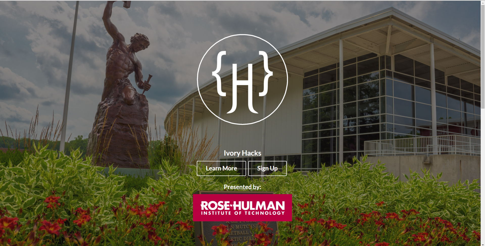
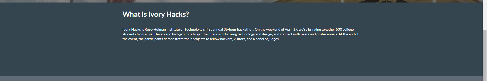
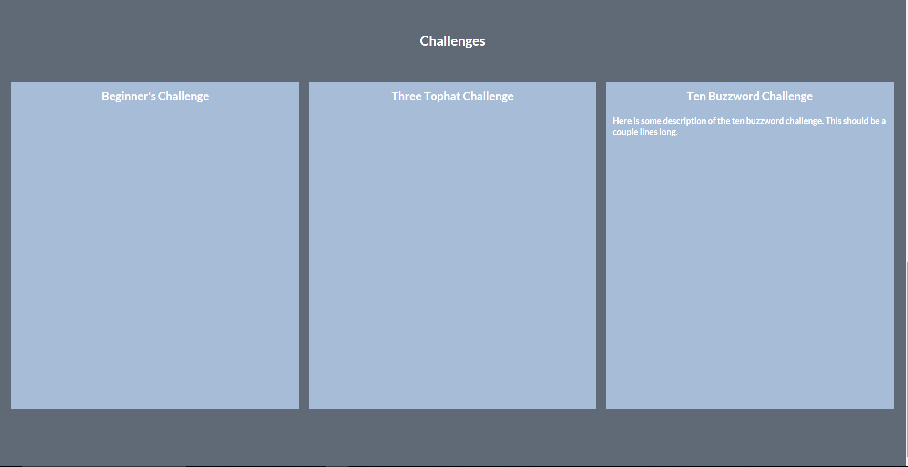
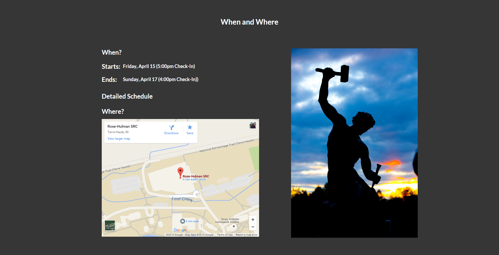
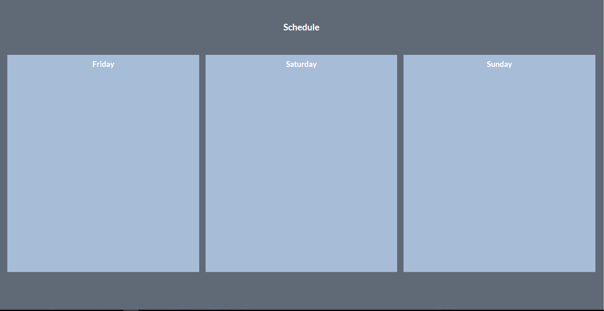

#Ivory Hacks
###Set Up
```bash
git clone https://github.com/Doolan/IvoryHacks.git
cd IvoryHacks
npm install #installs all of the packages
npm start
```
###_Required Tools_
_Install these first_

1. [Node.js](https://nodejs.org/en/)
2. [Git](https://desktop.github.com/)
3. nodemon
```bash
npm install -g nodemon
```
#Site Sections
##Main Page

##About Page

##Challenges Page

##When and Where Page

##Schedule Page



