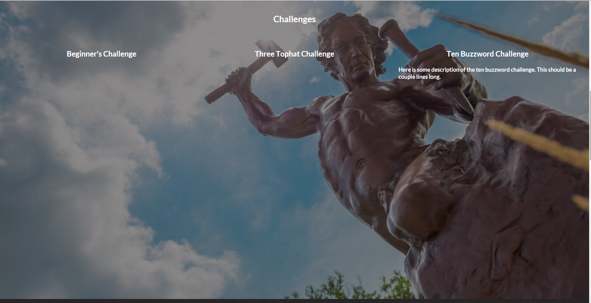
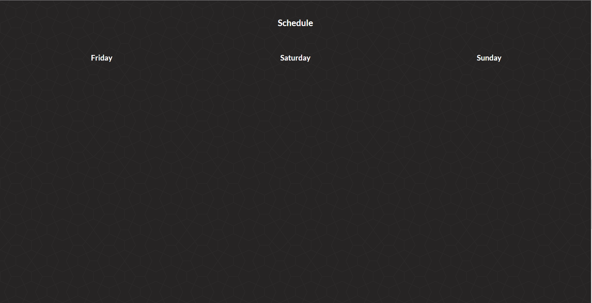
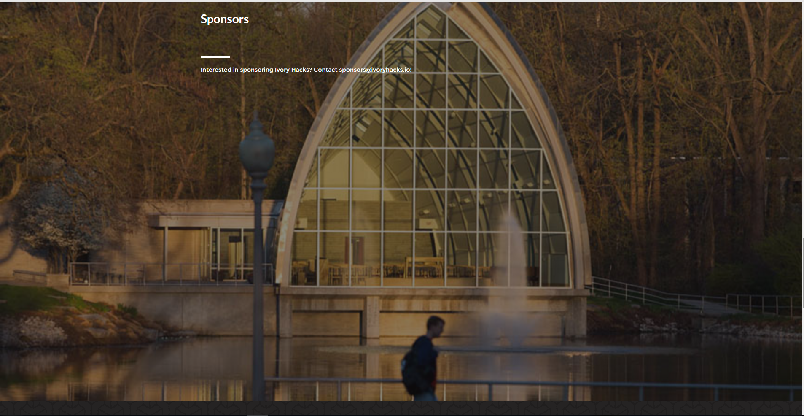

#Ivory Hacks
###Set Up
```bash
git clone https://github.com/Doolan/IvoryHacks.git
cd IvoryHacks
npm install #installs all of the packages
npm start #launches the site on http://localhost:3000/
```
###_Required Tools_
_Install these first_

1. [Node.js](https://nodejs.org/en/)
2. [Git](https://desktop.github.com/)
3. nodemon
```bash
npm install -g nodemon
```

###npm install errors
In the unlikely case Semanitic UI has installation errors:
```bash
npm install -g gulp
npm install semantic-u --save 
#Or
npm install
#Then
cd semantic-ui/
gulp build
```

#Site Sections
##Main Page

##About Page

##Challenges Page

##Schedule Page

##Sponsors Page

##FAQ Page

##Footer
The site ends in a full width interactive Google Map of Rose-Hulman's campus


